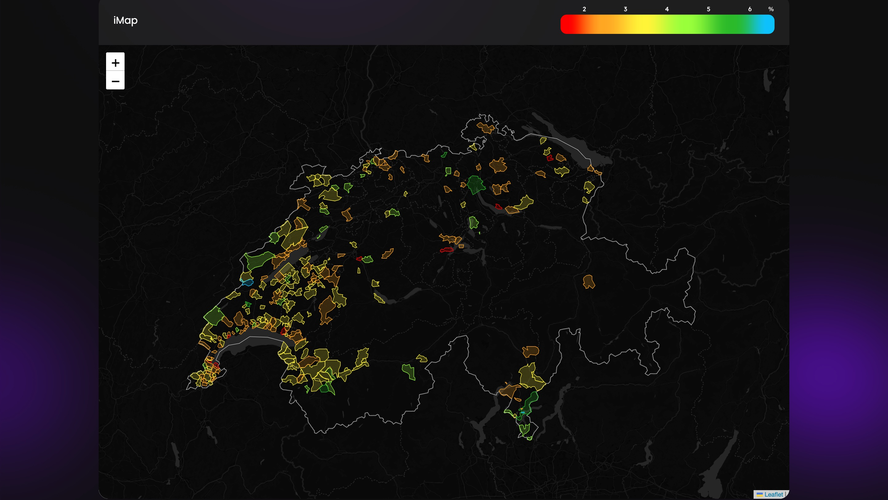
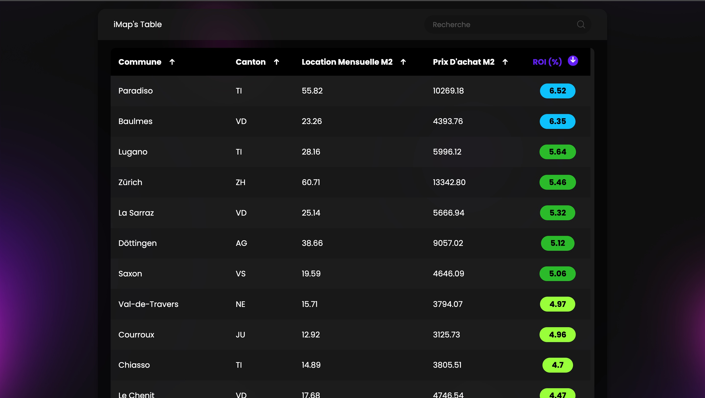

# 🏠 Immoly

### Swiss Real Estate Investment Analysis Platform

*A data-driven approach to property investment analysis across 200+ Swiss municipalities*

#

 

## 📖 Overview

Immoly was a SaaS platform designed to simplify property investment decisions in the Swiss real estate market. By aggregating and analyzing listing data from multiple sources, it provided investors with comparative insights into rental yields, purchase prices, and ROI across Switzerland's diverse municipal landscape.

   
    
   

      
      
   

---

 

## 🔧 Technical Architecture

### Data Pipeline

```mermaid
graph LR
    A[Web Scraping] --> B[Data Cleaning]
    B --> C[Analysis & Metrics]
    C --> D[GeoJSON Mapping]
    D --> E[Visualization]
```

<b>1. Data Collection</b>

- Automated web scraping of real estate listings from major Swiss property platforms
- Multi-source aggregation for comprehensive market coverage

<b>2. Data Processing & Analysis</b>

- **Tools**: Python, Jupyter Notebooks
- **Operations**: Data cleaning, normalization, and validation
- **Metrics**: Average price/m², rental yields, ROI calculations
- **Output**: Structured CSV datasets

<b>3. Geospatial Visualization</b>

- **Geographic Mapping**: Integration with public GeoJSON files for Swiss municipality boundaries
- **Interactive Map**: Leaflet.js-powered visualization
- **Export**: HTML files for sharing and embedding

<b>4. Frontend</b>

- **Stack**: HTML5, CSS3, Tailwind CSS
- **Features**: Responsive design, intuitive UI/UX

<b>5. Backend</b>

- **Runtime**: Node.js
- **Database**: MongoDB
- **Services**: Page routing/navigation, user authentication

---

## ✨ Key Features

### 🗺️ iMap - Interactive Geographic Explorer

Explore Switzerland's real estate landscape through an intuitive, color-coded map interface:

- **Coverage**: 200+ municipalities
- **Metrics**: Price/m² (purchase & rental), ROI
- **Interaction**: Click, zoom, and filter by region
- **Visualization**: Heat-map style rendering for quick insights

 

### 📊 Table - Advanced Data Analysis

Dive deep into the numbers with powerful filtering and sorting capabilities:

- **Filters**: Canton, price range, rental rates, ROI thresholds
- **Sorting**: Multi-column sorting for custom rankings
- **Export**: Download filtered datasets for external analysis
- **Comparison**: Side-by-side municipal comparisons

 

---

## ⚠️ Project Discontinuation

After extensive development, testing, and consultation with Swiss real estate professionals, I identified three fundamental flaws that undermined the platform's reliability:

#

### 1️⃣ **Inaccurate Location Data**

**Problem**: Sellers routinely list properties in prestigious neighboring municipalities to maximize visibility, even when the actual property is located elsewhere.

**Impact**: Municipal-level price averages became systematically skewed, rendering geographic comparisons unreliable for investment decisions.

#

### 2️⃣ **Listing Prices ≠ Sale Prices**

**Problem**: Published listing prices rarely reflect final transaction values due to:
- Negotiation dynamics
- Market conditions
- Property-specific factors
- Seller motivation

**Impact**: ROI calculations based on listing prices provided a fundamentally inaccurate view of true market values and investment returns.

#

### 3️⃣ **Price/m² Is an Inadequate Metric**

**Problem**: Price per square meter oversimplifies the complex factors that determine property value.

**Apartment Value Factors**:
- 🧭 Orientation (north vs. south-facing)
- 🌄 View quality and privacy
- 📍 Floor level and elevator access
- 🔨 Renovation status and finishes

**House Value Factors**:
- ♨️ Heating system type and efficiency
- ⚡ Energy performance rating
- 🏗️ Construction quality and materials
- 🚗 Parking and outdoor space

**Impact**: Two nearly identical properties in the same municipality can have drastically different values based on dozens of specific characteristics that municipal aggregation ignores.

---

## 💡 Key Takeaway

**Real estate value is hyper-local and property-specific.**  
Aggregating by municipality alone oversimplifies the market's complexity and provides limited actionable intelligence for serious investors.

While Immoly successfully demonstrated technical competency in data analysis, geospatial visualization, and full-stack development, it ultimately failed to deliver its core value proposition: **reliable investment insights**.

This realization led to the decision to discontinue the project.

---

## 🛠️ Tech Stack

| Layer | Technologies |
|-------|-------------|
| **Frontend** | HTML5, CSS3, Tailwind CSS |
| **Backend** | Node.js, Express |
| **Database** | MongoDB |
| **Data Analysis** | Python, Pandas, Jupyter |
| **Visualization** | Leaflet.js, GeoJSON |
| **Scraping** | Web Scraper Chrome Extension |

---

## 📚 Lessons Learned

1. **Domain expertise is critical** - Technical execution alone cannot overcome flawed assumptions
2. **Validate core assumptions early** - Test fundamental hypotheses before building
3. **Simple metrics can be deceptive** - Price/m² seems logical but lacks predictive power
