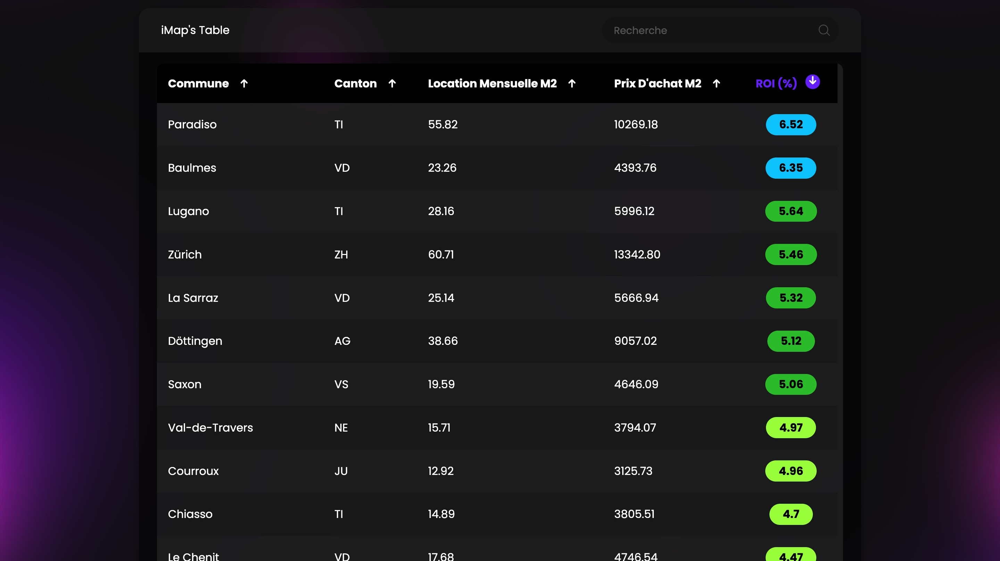

# Immoly

Immoly was a SaaS platform dedicated to simplifying property investment decisions for optimal returns in the Swiss real estate market. Its intuitive interface facilitated effortless comparisons of rental and purchase prices per square meter across 200 municipalities. Additionally, Immoly meticulously calculated the Return on Investment (ROI), pinpointing the most lucrative investment opportunities.

   
   

      
      
   

## How It Worked

1. **Data Collection**:
   - Scraped real estate listings from multiple Swiss property websites.

2. **Data Processing and Analysis**:
   - Used Python within Jupyter Notebooks to clean and analyze the scraped data.
   - Calculated relevant metrics (average price per m², ROI, etc.).
   - Exported the processed results as CSV files for further use.

3. **Geospatial Visualization**:
   - Linking Data to Geography: Mapped the cleaned data to municipalities using a public GeoJSON file containing the shapes of all Swiss municipalities.
   - Interactive Map Creation: Used Leaflet.js to build an interactive map displaying the data at the municipal level.
   - Map Export: Exported the resulting interactive map to an HTML file for easy sharing and visualization.

4. **Front End**:
   - Built using HTML/CSS with the utilization of Tailwind CSS for enhanced styling.

5. **Back End**:
   - Developed using JavaScript with Node.js and MongoDB, providing robust functionality to support the platform's operations and user authentication.

## Features

### iMap

iMap offered an interactive map where users could explore over 200 Swiss municipalities. It displayed prices per square meter for buying, renting, and ROI for each area, making it effortless to identify lucrative investment opportunities.

### Table

The Table module enabled users to view and analyze data in a structured manner. With options to filter and sort by canton, price, rental rates, or ROI, users could quickly find the information they needed without any hassle.
